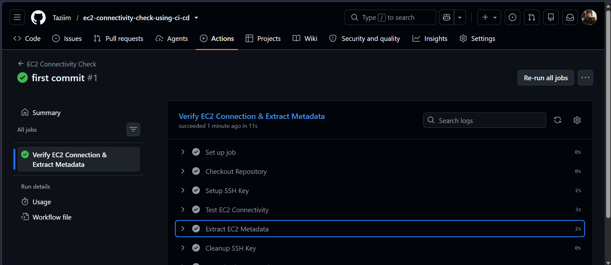

# AWS EC2 Health Check Pipeline
A CI/CD automation project that validates AWS EC2 instance connectivity and performs infrastructure health checks using DevOps practices.

## Project Overview
This project demonstrates how to automate EC2 connectivity verification using a CI/CD pipeline.
The pipeline checks whether an EC2 instance is reachable and helps validate AWS infrastructure availability before deploying applications or running automated tasks.

##  Architecture
```
Developer
    |
    |
Git Repository
    |
    |
CI/CD Pipeline
(GitHub Actions)
    |
    |
AWS Authentication
    |
    |
EC2 Connectivity Check
    |
    |
Pipeline Result
```
## Technologies Used
* AWS EC2 instance
* GitHub Actions / CI/CD
* Git 

## How It Works
1. Developer pushes code to the repository
2. CI/CD pipeline starts automatically
3. Pipeline authenticates with AWS
4. Pipeline checks EC2 instance connectivity
5. Show the metadata

## Implementations
# Step 1:
1. Created the yml file for connectivity check. 
2. Created a ec2 instance.
3. Added the variables into the secret and variables options.
# Step 2:
1. EC2 host => ip address of ec2 instance.
2. EC2 user => ubuntu.
3. EC2 ssh key => ssh key 
# Step 3.
1. Copy the public key from local machine ssh directory
2. Run this command on ec2
```bash
mkdir -p ~/.ssh
nano ~/.ssh/authorized_keys
```
3. Paste the key to the bottom 
4. Fix the permissions
```bash
chmod 700 ~/.ssh
chmod 600 ~/.ssh/authorized_keys
```
5. Add private key to GitHub Secrets

## Example EC2 Metadata Token Usage
The project uses AWS EC2 Instance Metadata Service (IMDSv2):
```bash
TOKEN=$(curl -s -X PUT \
"http://169.254.169.254/latest/api/token" \
-H "X-aws-ec2-metadata-token-ttl-seconds: 21600")
```
This creates a temporary metadata access token used for secure communication with the EC2 metadata service.

## Future Improvements
* Add AWS CloudWatch monitoring
* Add Slack/email notifications
* Add Terraform infrastructure provisioning
* Add Docker support
* Add automated deployment stages

## Screenshots


*Tariqul Islam*  
📧 Email: tariqulislamtazim99@gmail.com  
🔗 LinkedIn: https://www.linkedin.com/in/tariqulislamtazim/
---

## License
This project is created for learning and DevOps practice purposes.


